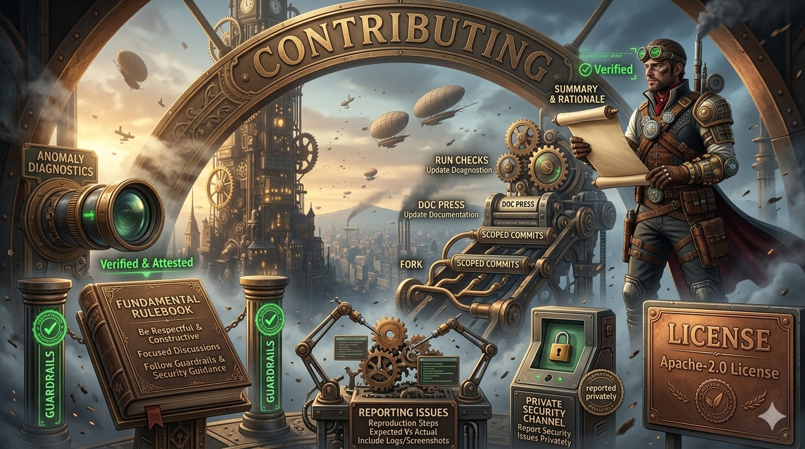

\

# Contributing

Thanks for your interest in contributing.

## Ground Rules
- Be respectful and constructive.
- Keep discussions focused on improving the project.
- Follow the repository guardrails and security guidance.

## How to Contribute
1. Fork the repo and create a feature branch.
2. Make changes with clear, scoped commits.
3. Update or add documentation when behavior changes.
4. Run any relevant checks or scripts.
5. Open a pull request with a concise summary and rationale.

## Reporting Issues
- Use clear reproduction steps.
- Include expected vs actual behavior.
- Provide logs or screenshots when relevant.

## Security
If you discover a security issue, please report it privately.

## License
By contributing, you agree that your contributions are licensed under the Apache-2.0 License.
