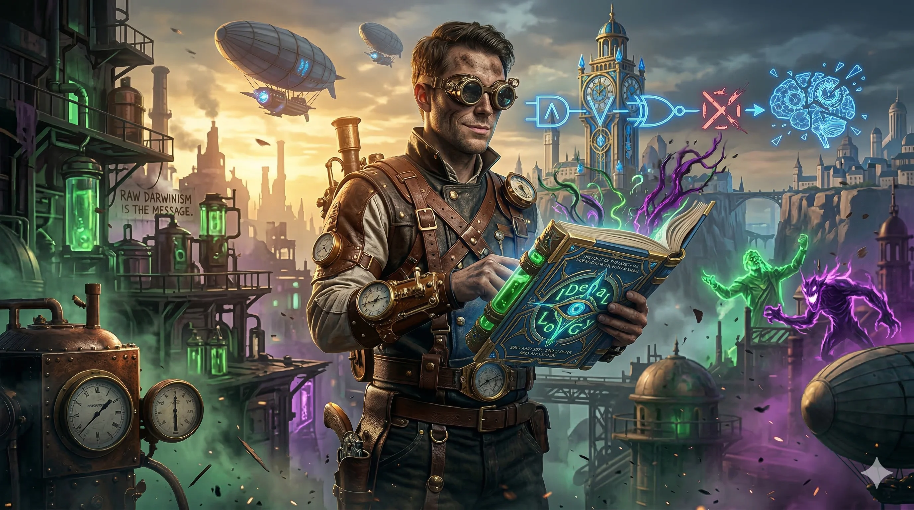

# What is Wrong with Religions - Biased Interpretation

Ideology by itself is a neutral train of thought. But when it becomes applied ideology or organized religion and finds its targeted audience—if the message is not clear, which is almost always the case with every school of thought—then we end up with raw Darwinism. It's like going full Tarantino: escalating from a comedy to a full tragedy, leading to the total annihilation of others, themselves, and everything else.

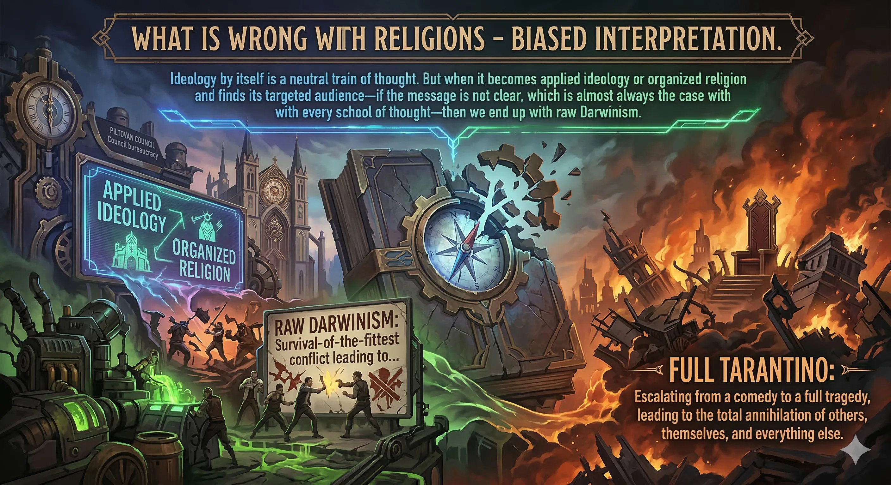

## Been There Done That! WTH! Identical!
I used to think the world works like this when I was clueless, and all of my guesses were proven to be wrong. I was so wrong, yet so confident, that I felt dumb for years. But why?

I think we believe things should work a certain way because we say so, or because of our so-called "self-reflection." But in reality, things working or not working, transitioning or shifting, evolving or changing states happen for a set of good reasons. When we don't understand, assuming "there must be a reason we don't know" or "God works in mysterious ways" is the dumbest way of saying "I have no fucking clue." Maybe the problem is your egomaniacal, self-centered, so-called intellectual dumbness, bro and sister. And Jesus was a son of a bitch whose mom blamed God for her pregnancy.

Joke, sarcasm, truth, probable, possible—some may even kill for the above paragraph. But one thing is a fact: we don't know, we're not sure, so we describe it as a mystery. It's like the word "Gay," which literally means happy, but marriage between a man and a woman somehow got fucked up. Been there, done that for 21 years. Now I am trying to un-fuck it. Not because we fucked it up—no, we both are caring and loving and we do not know any other way. Except me, I always find a way to forgive and kill 'em with kindness, but only after cursing and all.

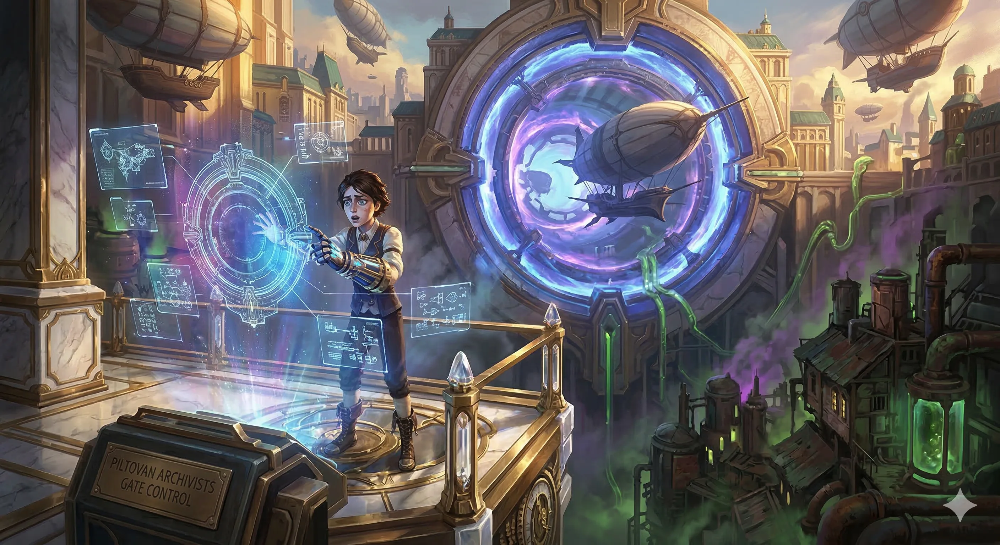

## What is Wrong With Us? Nothing but Everything! WTH!
By now, you must know my writing, talking, and train of thought style, but let me break it down starting from the very title leading these comments.

I am precise about labeling fact, fiction, opinion, "they say", "we think", etc. At the same time, I might seemingly be repeating myself. But come on, after all of this, it's just saying the very same thing for different audiences—multi-language, multi-audience, or language & domain agnostic. 

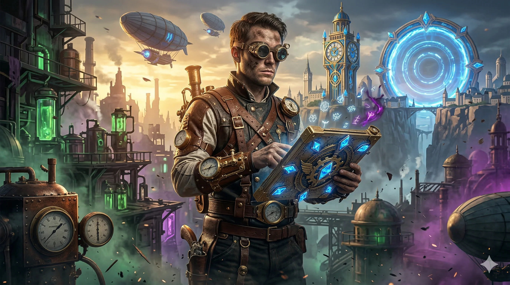

## Slice & Dice to Dissect & Crack It Open!
Above all, when I squeeze it into a one-line title, it tells it all. Let's see:
    - Profound, Ambiguous, Very Deep & Fundamental Question: What is Wrong With Us?
    - Simply: Q, A, Emotion
    - Q: What ... US?
    - A: Nothing (None) but (Meta-Scope) Everything (All)
    - E: 0 x infinite =!= 0 =!= Infinite

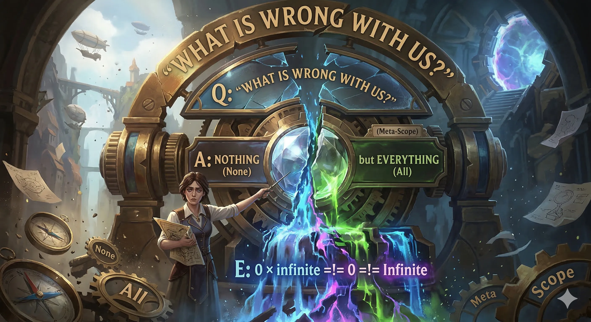

## E Factor
Emotion Factor is the undeniable Conclusion with simple Q&A that point to ambiguity, duality, and being two opposite sides of the spectrum at the same time. But if we clarify the ambiguity, then Q&A becomes Bias, Fact, Fiction, FacTion, AdOps, Op-Ed, or any other label which may Lie, Fucking Lie, Mask The Truth, Dominate, Threaten, or Humbly State The Facts. Then we all translate and transform these labels to our liking and decipher them. So I say Fact, you hear insult. I tell a fiction fairy tale, you get offended and want to (and will) kill me. Seriously, we all do it. But I do it to teach others what to do and what not to do as patterns, Anti-Patterns, DOs & DON'Ts, or simply a fully automated CI/CD in my brain continuously, or Tips & Tricks & Pitfalls like Good, Bad, Ugly—such as Once Upon a Time In America / Hollywood / HolyLand / Heaven / Hell / Matrix / WonderLand / Caribbean / GoT / LaLaLand...

"Once Upon a Time In America" & "Once Upon a Time In Hollywood": some are movies, some are ideologies worth killing for and sacrificing humanity for, according to some idiots throughout history. Hence—am I right or are you ALL Wrong Miserably (but not mysteriously)? All of you, no exception. Except if you agree with me that you are right and I am wrong. Is that not an egoistic way of "I know what I know and I know what you don't know"? The statement is rigged, and the answer and the verdict are given when I state "I am right and you are all wrong". Since regardless, if two opposing statements are both truth, it's called a Paradox. If one is truthy, that makes the second one don't care or faulty. In contrast, anyone can claim you are dead wrong and we are right, but anyhow, both cannot be true AND false at the same time.

AND is true if all elements of AND are truthy: 1 = 1 & 1 & 1 & ...
OR is truthy if ONE element is truthy: 1 = 0 | 0 | 1 | ...

AND, OR, XOR, NAND... Simple Electronic LOGIC. The logic of the logic in any domain is the same, but if your logic is not logical, I have no idea what the fuck you are talking about!? AM I RIGHT OR WHAT BITCH!? 😉🥳🚀🎯🤪 TADA!

---

## The Big Three (And The Wildcards): Schools of Thought Unfiltered

Let's dissect exactly how applied ideology goes off the rails across different spectrums. 

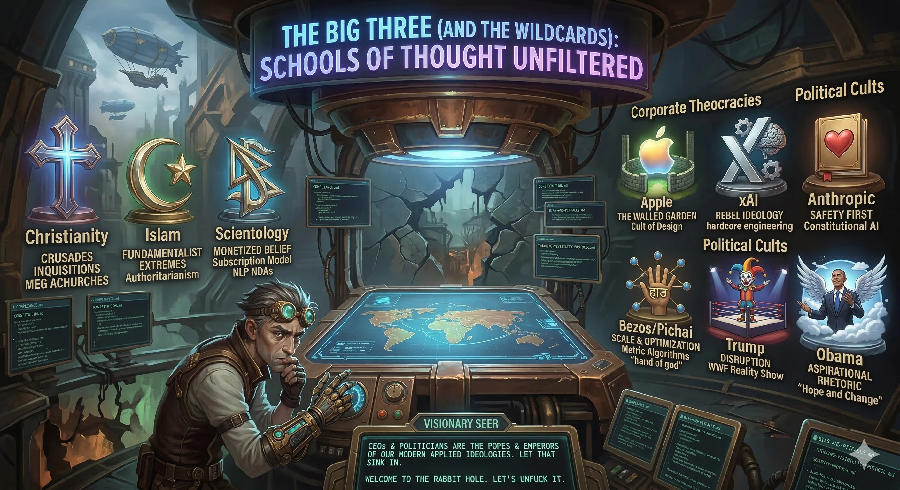

### Christianity
"Love thy neighbor" somehow evolved into crusades, inquisitions, and deep-pocketed megachurches. The doctrine itself has moments of profound brilliance—sacrificial love, forgiveness, grace. But once you wrap it in human bureaucracy and political ambition, it becomes a weapon of mass behavioral control. 

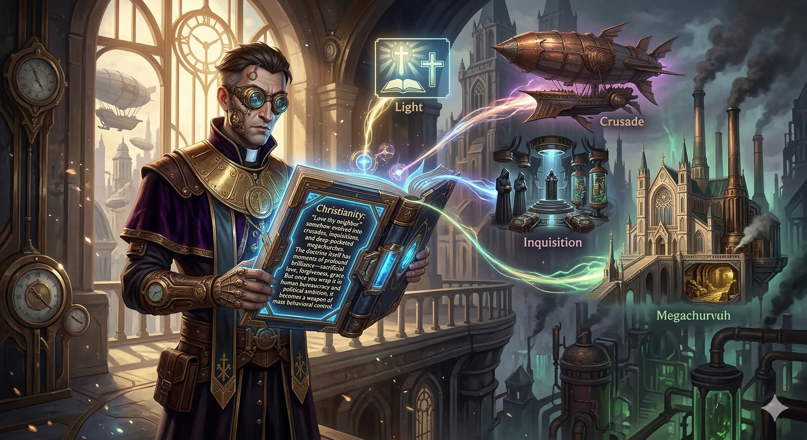

### Islam
A religion built on profound foundations of discipline, charity, and submission to the divine. Yet, fast forward past the golden age of Islamic science and mathematics, and we see applied ideology getting hijacked by fundamentalist extremes to justify absolute authoritarianism. It's the ultimate example of how pure semantic doctrine gets twisted into dogmatic enforcement when power comes into play.

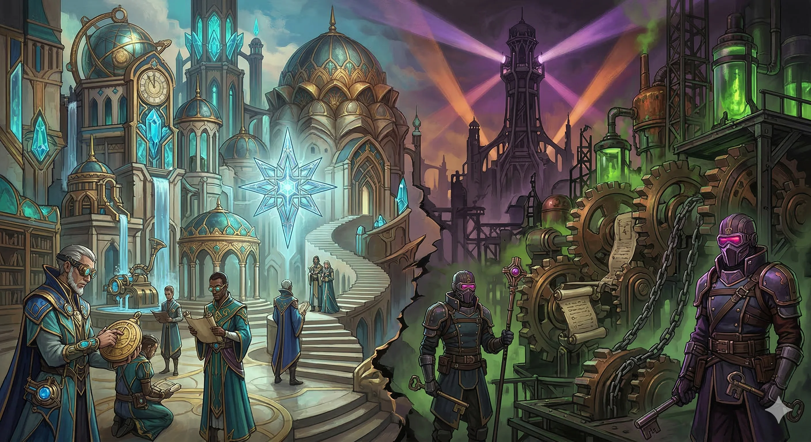

### Scientology (The Corporate Ideology)
If the above two are ancient, entrenched paradigms, then Scientology is modern ideology rendered as an aggressive, litigious startup. It successfully monetized belief and turned the abstraction of "spiritual growth" into a multi-tiered subscription model with NDAs. This isn't just a religion; it's pure, weaponized NLP (Neuro-Linguistic Programming) wrapped in corporate copyright law.

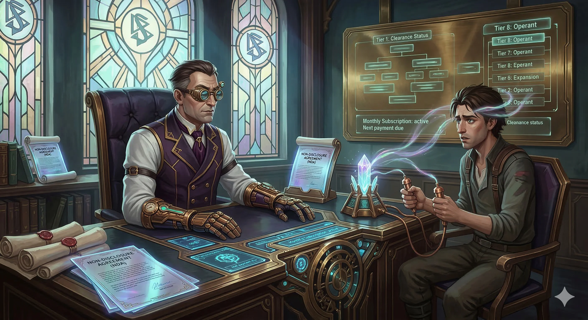

### Schools of Thought & Philosophy
Whether it's Stoicism, Marxism, Capitalism, or Nihilism. They all start as valid, neutral lenses to view the world. But give them to humans, and we'll immediately form "in-groups" and "out-groups." We create purity tests. A philosophical framework is a tool, not a suicide pact. We shouldn't be dying for these ideas—the ideas should be working for us.

### Personal Note — Faith, Doubt, and Self-Correction
Religion can inspire discipline, charity, and meaning, but it can also make decent people do terrible things while genuinely believing they are doing moral work. The safer pattern is humility: the moment you realize you might be wrong, dig deeper instead of doubling down. See [`../../RELIGION.md`](../../RELIGION.md) for the broader meta-analysis instead of duplicating it here.

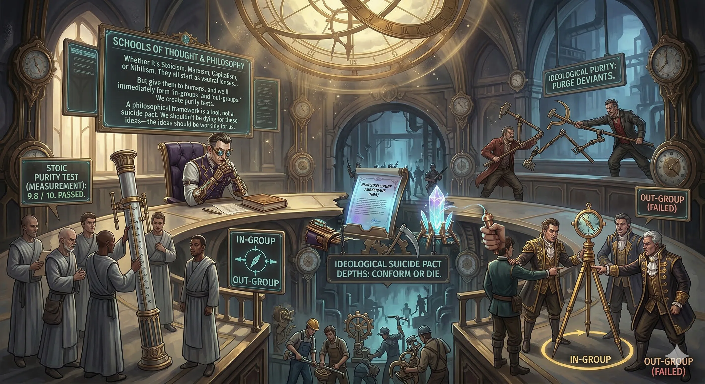

---

## Belief, Ideology & Religion in Politics, Policy & Corporate Dominance

Here's the required R&D on the reality we live in today. Belief and Ideology don't just exist in churches—they govern the world's largest megacorps and political superstructures. 

### The Corporate Theocracies
- **Apple (The Walled Garden):** This isn't a tech company; it's a cult of design and behavioral conditioning. The "Apple Store" is the cathedral. The policies they enforce on their App Store are ideological decrees determining what developers can and cannot do to survive in their economy.
- **xAI & Elon Musk:** The edgy rebel ideology. The doctrine of "Free Speech Absolutism" mixed with hardcore engineering. It challenges the norm but requires its own blind faith in the chaotic genius model.
- **Anthropic, Dario Amodei, & Claude:** The "Safety First" ideology. Their Constitutional AI is literally a digital bill of rights functioning exactly like a religious text guiding the AI's moral compass. It’s an attempt to hardcode theology into a neural network.
- **Bezos & Pichai:** The ideology of Scale and Optimization. For Amazon and Google, algorithms are the invisible হাত (hand) of god. Everything is subservient to the metric, the engagement, and the efficiency. 

### The Political Cult of Personality
- **Trump:** The Ideology of Disruption and Friction. He turned policy-making into a WWF reality show, leveraging pure emotion, grievance, and visceral marketing to overwrite institutional norms.
- **Obama:** The Ideology of Aspirational Rhetoric. Smooth, eloquent, inspiring. It showed that if you wrap standard establishment policies in enough "Hope and Change," people will treat political administration like a transformative spiritual movement.

We constantly swap one set of dogmas for another. Today's CEOs and Politicians are the Popes and Emperors of our modern applied ideologies. They dictate the rules, shape our logic, and define our reality. Let that sink in.

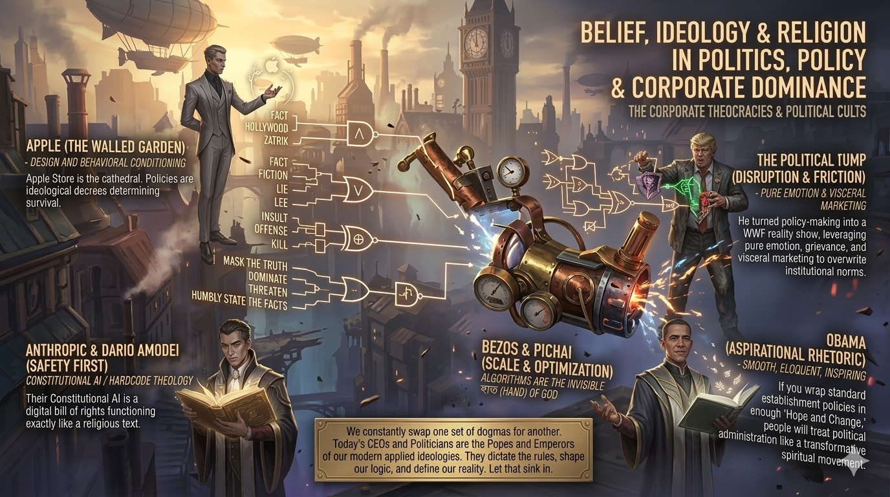

---

## README Summary & Meta Scope

### Project Manifest files
- [COMPLIANCE.md](../../COMPLIANCE.md) - The laws of the land.
- [CONSTITUTION.md](../../CONSTITUTION.md) - Foundational values.
- [MANIFESTO.md](../../MANIFESTO.md) - The rallying cry.
- [BIAS-AND-PITFALLS.md](../../BIAS-AND-PITFALLS.md) - Recognizing cognitive blindspots.
- [THINKING-VISIBILITY-PROTOCOL.md](../../THINKING-VISIBILITY-PROTOCOL.md) - Making the invisible visible.
- [SECURITY-PROTOCOL.md](../../SECURITY-PROTOCOL.md) - Defense in depth.

### Conclusion Integration
Everything is connected. This directory (`Domains/Idealogy/`) is the philosophical core that powers the actual logic in our code and content. If you can't understand the biases, the religious adherence to corporate structures, and the emotional hijacking we undergo daily, you can't write code or build systems that truly fix the world.

Welcome to the rabbit hole. Let's unfuck it.

### Prompt Themes

Image generation prompts used for this document follow an **Arcane / RIOT Games** visual style: painterly, high-contrast, neon-noir with a cyberpunk-Gothic undercurrent. Each concept (ideology, religion, corporate theocracy, personality cult) is rendered as a faction or champion — equal parts beautiful and brutal. Think Viktor's hextech fused with a cathedral. Think Jinx's chaos as a policy manifesto. Apply that lens to every image in this directory.
