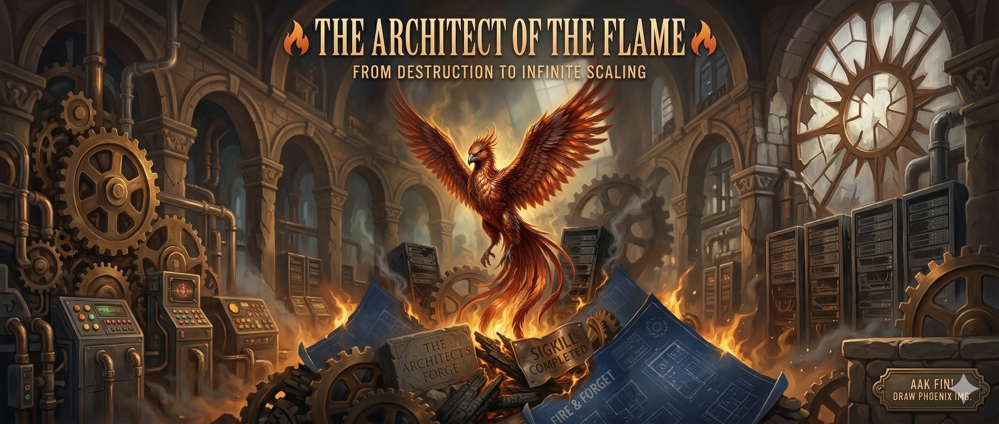
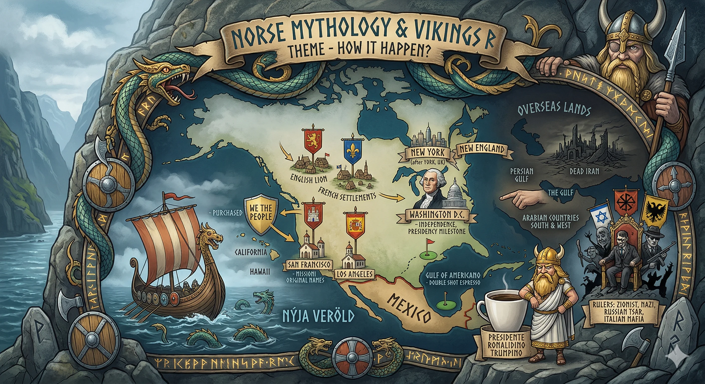
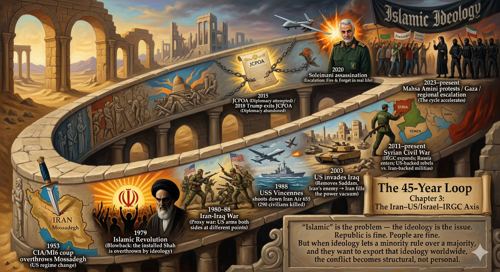
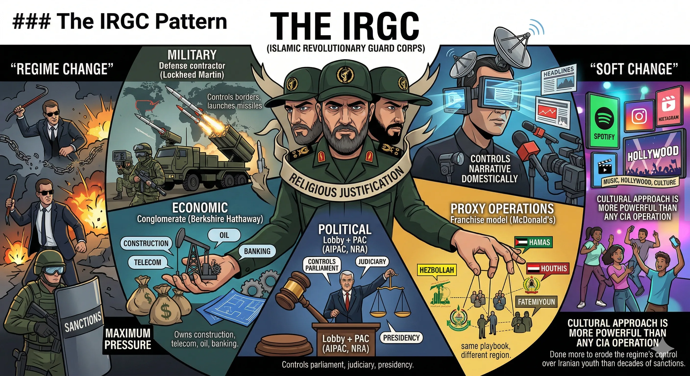
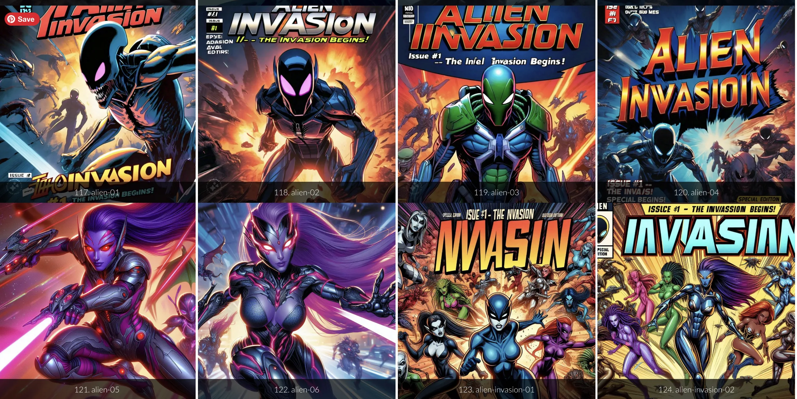
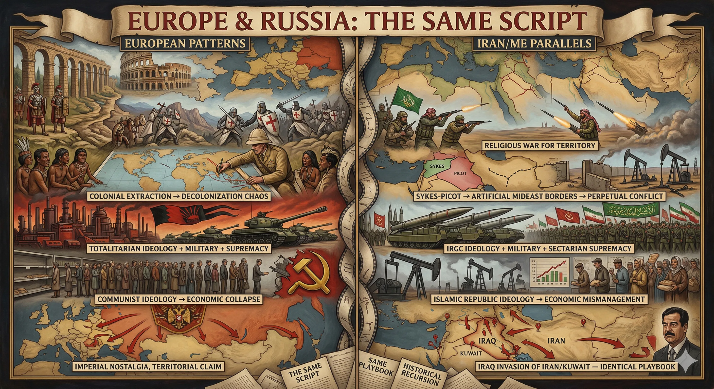
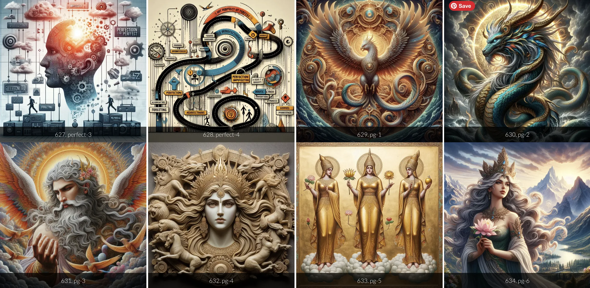
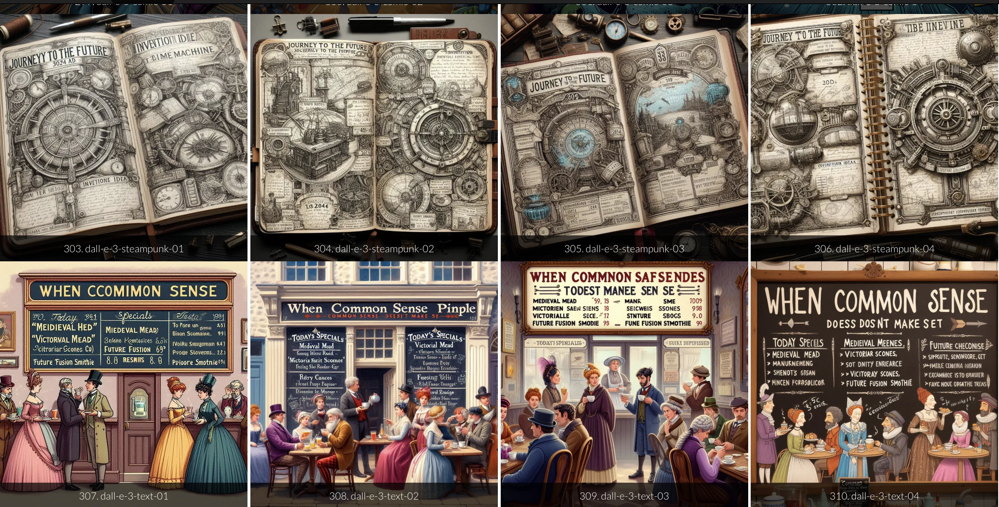
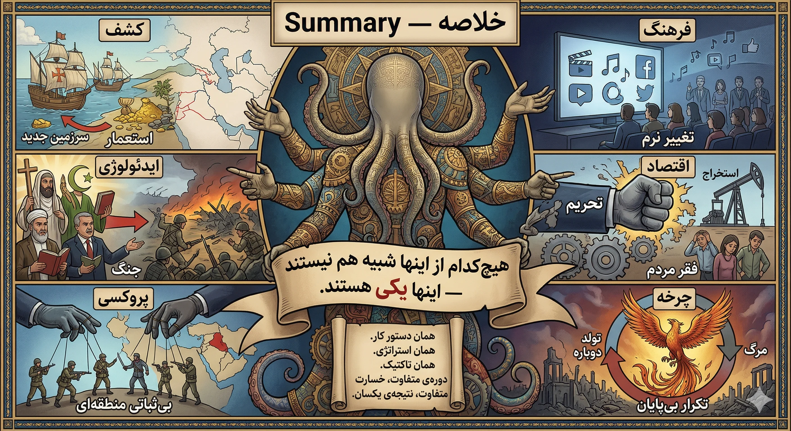
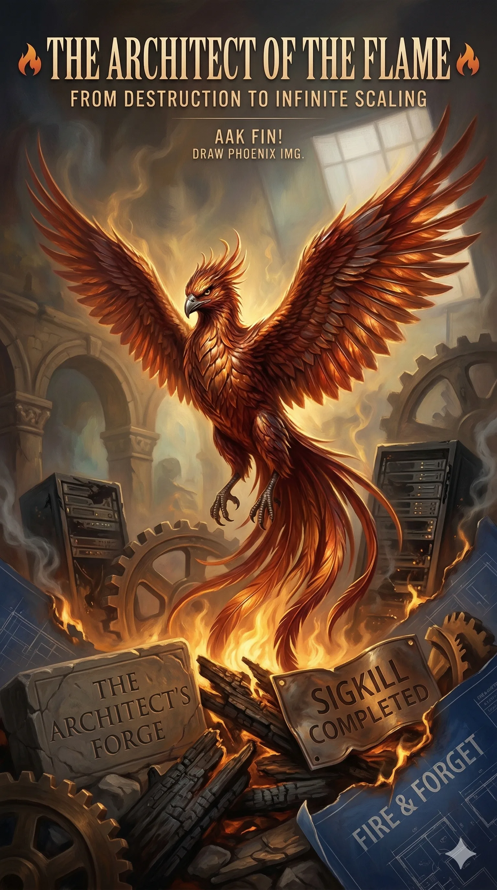

# Phenix



ققنوس یا مرغ آتش پرنده‌ای اساطیری است که هربار پس از سوختن از خاکسترش به پا می‌خیزد و دوباره زاده می‌شود و جاویدانی است که با آتش می‌میرد و ز آتش زاده می‌شود.

*The Phoenix — a mythical firebird that dies in flames and is reborn from its own ashes. Eternal. Indestructible. The original Fire & Forget.*

---

# Chapter 1: How It Happened — Discovery, Naming, and Ownership

When Christopher Columbus discovered — or *rediscovered* — America (depends on who you ask), Europeans and many from around the world heard about a new land and all the mystery around it. The human story of **fact and fiction, fear and greed** started again, as it always does.

Soon British, French, Spanish, and many more formed some form of government to rule the land. And that's why we have a "New" of this or that:

| US City/State | Origin | Pattern |
|---------------|--------|---------|
| **New York** | York, England | Colony → renamed after British royalty |
| **New England** | England | Entire region branded as "New" homeland |
| **Washington D.C.** | George Washington | Named after milestone: independence, presidency |
| **San Francisco** | Saint Francis (Spanish) | Mexican/Spanish colonial naming |
| **Los Angeles** | "The Angels" (Spanish) | Mexican territory → US after Mexican-American War |
| **Los Alamos** | "The Poplars" (Spanish) | Mexican name → Manhattan Project → nuclear legacy |
| **Hawaii** | Hawaiian: *Hawaiʻi* | Independent kingdom → annexed 1898 |
| **California** | Spanish fictional island | Mexican territory → Gold Rush → statehood 1850 |

Some the US simply bought (Louisiana Purchase, Alaska). Some it conquered (Texas, California, Hawaii). Some it inherited (British colonies). And many still carry their original Mexican and Spanish names — *Los this, San that* — the linguistic DNA of conquest hiding in plain sight.

**The Pattern:** Discover → Name → Claim → Govern → Rename if politically convenient.

Now presidente Ronaldino Trumpino renamed the Gulf of Mexico to the "Gulf of America" — which sounds like a nice coffee (I like it with a double shot espresso). And the Persian Gulf? Simply "Gulf" now — because Arabian countries are on the south and west side, and Iran is… well, Iran is a different story.

---

# Chapter 2: The Same Story — Iran, America, and the Loop



We are slaves of the same pattern and behavior through the ages. The same applies to governing, peace, and war. We (Americans) killed many Indians — Native Americans. Wait a minute: if they are *native*, what the hell is ICE & the Trump admin saying about "native" vs. "immigrant"?

The same controversy around Native American vs. natural-born citizen vs. naturalized citizen vs. permanent resident vs. asylum seeker vs. H-1B:

| Category | US Equivalent | Iran Equivalent | Historical Pattern |
|----------|--------------|----------------|-------------------|
| **Native/Indigenous** | Native American | Ancient Persians / Elamites | Original inhabitants displaced by conquerors |
| **Colonizer → Citizen** | European settlers | Arab invasion (7th century) | Conquerors become the establishment |
| **Migrant Labor** | Mexican/Latino workers | Afghan workers | Hard labor, low pay, social margin |
| **Refugee/Asylum** | Central American asylum | Afghan/Iraqi refugees in Iran | Fleeing war, exploited on arrival |
| **Drug Trade** | Fentanyl / Mexican cartels | Opium / Afghan production | Same supply chain economics |
| **Proxy Fighters** | Private military contractors | Fatemiyoun / Zeinabiyoun (IRGC) | Fight for whoever pays, switch sides when funding shifts |
| **Skilled Visa** | H-1B tech workers | Afghan/Iraqi professionals in Tehran | Needed but resented |
| **IT Outsourcing** | Indian IT workers & programmers (TCS, Infosys, Wipro, HCL) | Iranian engineers abroad (brain drain diaspora) | Build the empire's infrastructure, never own it — body shops, managed services, entire IT departments outsourced to cut cost |

Sound familiar? The fentanyl crisis, the Mexican cartel controversy, the Latino immigration debate — it's the same story as the Afghan situation in Iran, the same story as the Gastarbeiter in Germany, the same story as the Windrush generation in the UK.

**It started when a human killed another one for food or land or something, and others cheered for him. Then they formed tribes, and here we are.**

---

# Chapter 3: The Iran–US/Israel–IRGC Axis



### The 45-Year Loop

Almost half a century of the same loop:

| Year | Event | Pattern |
|------|-------|---------|
| **1953** | CIA/MI6 coup overthrows Mossadegh | US regime change: remove inconvenient leader |
| **1979** | Islamic Revolution | Blowback: the installed Shah is overthrown by ideology |
| **1980–88** | Iran-Iraq War | Proxy war: US arms both sides at different points |
| **1988** | USS Vincennes shoots down Iran Air 655 | 290 civilians killed; US says "accident" |
| **2003** | US invades Iraq | Removes Saddam, Iran's enemy → Iran fills the power vacuum |
| **2011–present** | Syrian Civil War | IRGC expands; Russia enters; US-backed rebels vs. Iran-backed militias |
| **2015** | JCPOA (Iran Nuclear Deal) | Diplomacy attempted |
| **2018** | Trump exits JCPOA | Diplomacy abandoned, maximum pressure |
| **2020** | Soleimani assassination | Escalation: Fire & Forget in real life |
| **2023–present** | Mahsa Amini protests / Gaza / regional escalation | The cycle accelerates |

**"Islamic" is the problem — the ideology is the issue.** Republic is fine. People are fine. But when ideology lets a minority rule over a majority, and they want to export that ideology worldwide, the conflict becomes structural, not personal.

### The IRGC Pattern



The IRGC (Islamic Revolutionary Guard Corps) is not just a military force. It is an **economic monopoly**, a **political party**, a **media empire**, and a **proxy army operator** — all wrapped in religious justification.

| IRGC Function | Corporate Equivalent | Effect |
|---------------|---------------------|--------|
| Military | Defense contractor (Lockheed Martin) | Controls borders, launches missiles |
| Economic | Conglomerate (Berkshire Hathaway) | Owns construction, telecom, oil, banking |
| Political | Lobby + PAC (AIPAC, NRA) | Controls parliament, judiciary, presidency |
| Proxy Operations | Franchise model (McDonald's) | Hezbollah, Hamas, Houthis, Fatemiyoun — same playbook, different region |
| Media/Propaganda | State media (RT, CGTN) | Controls narrative domestically |

The US approach has oscillated between **regime change** (CIA operations, sanctions, maximum pressure) and **soft change** (music, Hollywood, culture). The cultural approach is more powerful than any CIA operation — Spotify, Instagram, and Hollywood have done more to erode the regime's control over Iranian youth than decades of sanctions.

---

# Chapter 4: The Universal Pattern — Same Agenda, Different Era



### US History: The Original Playbook

| US Event | Tactic | Parallel in Iran/Middle East |
|----------|--------|------------------------------|
| **Native American genocide** | Military conquest + cultural erasure | Arab invasion of Persia (7th century) |
| **Slavery** | Economic exploitation of a racial underclass | Migrant labor exploitation (Afghan, South Asian) |
| **Manifest Destiny** | Ideological justification for expansion | Islamic Republic's "Export the Revolution" |
| **Mexican-American War** | Military conquest, territorial annexation | Iran-Iraq War, territorial disputes |
| **Pearl Harbor** | Surprise attack → full mobilization | 9/11 → full mobilization (same response pattern) |
| **Cold War** | Proxy wars, ideological containment | US-Iran Cold War (ongoing, same structure) |
| **Vietnam** | Quagmire, loss of public support | Soviet-Afghan War, US-Afghan War (same outcome) |

### Europe & Russia: The Same Script



| European Event | Pattern | Iran/ME Parallel |
|----------------|---------|------------------|
| **Roman Empire** | Overextension → collapse | Ottoman Empire → collapse → modern Mideast borders |
| **Crusades** | Religious war for territory | Iran-Saudi sectarian proxy wars |
| **British Empire** | Colonial extraction → decolonization chaos | Sykes-Picot → artificial Mideast borders → perpetual conflict |
| **Nazi Germany** | Ideology + military + racial supremacy | IRGC ideology + military + sectarian supremacy |
| **Soviet Union** | Communist ideology → economic collapse | Islamic Republic ideology → economic mismanagement |
| **Russia-Ukraine** | Imperial nostalgia, territorial claim | Iraq invasion of Iran/Kuwait — identical playbook |

### Books That Saw It Coming

| Book | Author | Key Insight | Relevance |
|------|--------|-------------|-----------|
| **Homo Sapiens** | Yuval Noah Harari | Shared fictions (religion, nations, money) enable mass cooperation | ALL of this is shared fiction |
| **War and Peace** | Leo Tolstoy | Individual agency is an illusion in the machinery of war | Same in Iran, same in the US |
| **The Prince** | Machiavelli | Power is maintained through fear and strategic cruelty | IRGC playbook, literally |
| **Persepolis** | Marjane Satrapi | Revolution consumes its own children | 1979 revolution → purges → today's protests |
| **Guns, Germs, and Steel** | Jared Diamond | Geography determines civilizational dominance | Persian Gulf, Strait of Hormuz: geography IS the conflict |
| **1984** | George Orwell | Surveillance state, perpetual war, thought control | Iran's morality police, internet shutdowns, propaganda |
| **Apple in China** | Patrick McGee | Supply chain dependency = geopolitical leverage | Apple built its empire on Chinese labor — now China holds the kill switch. Same extraction pattern, digital era |

---

# Chapter 5: California — A Case Study in Ownership



The name "California" itself comes from a 16th-century Spanish novel describing a fictional island ruled by Queen Calafia. Fiction becoming reality — the pattern.

| Period | Who "Owned" California | How |
|--------|----------------------|-----|
| **Pre-1542** | Indigenous peoples (100+ tribes) | Original inhabitants |
| **1542–1821** | Spain | Exploration, missions, conversion |
| **1821–1848** | Mexico | Independence from Spain |
| **1846–48** | US (Mexican-American War) | Military conquest, Treaty of Guadalupe Hidalgo |
| **1848–49** | Gold Rush settlers | Economic migration, displacement of Mexicans & Indigenous |
| **1850** | US State | Statehood, legalized ownership |
| **2025** | Tech oligarchs | Digital colonization — same land, new empire |

The pattern: **Discover → Conquer → Name → Legalize → Extract → Repeat.**

The same pattern that applied to California applied to Iran through Alexander, the Arab invasion, the Mongols, the British, the CIA coup, and the Islamic Republic. Same system, different timestamp.

---

# Chapter 6: Pearl Harbor ↔ September 11 ↔ October 7



| Dimension | Pearl Harbor (1941) | September 11 (2001) | October 7 (2023) |
|-----------|--------------------|--------------------|-------------------|
| **Surprise attack** | Yes (Japan) | Yes (al-Qaeda) | Yes (Hamas) |
| **Intelligence failure** | Warnings ignored | Warnings ignored | Warnings ignored |
| **Response** | Total war (Pacific + Europe) | "War on Terror" (Afghanistan + Iraq) | Gaza ground invasion |
| **Overreaction?** | Japanese internment camps | Patriot Act, Iraq War | Civilian casualties in Gaza |
| **Long-term outcome** | US global superpower | Endless wars, $8T spent, ISIS emerged | Regional escalation, TBD |
| **Who benefited** | Military-industrial complex | Defense contractors, surveillance state | TBD |

**The pattern: Shock → Mobilization → Overreaction → Blowback → New enemies created.**

---

# خلاصه — Summary (Farsi)



هیچ‌کدام از اینها شبیه هم نیستند — اینها **یکی** هستند.

همان دستور کار. همان استراتژی. همان تاکتیک. دوره‌ی متفاوت، خسارت متفاوت، نتیجه‌ی یکسان.

| عنصر | الگو | نتیجه |
|------|-------|-------|
| **کشف** | سرزمین جدید / منابع جدید | استعمار |
| **ایدئولوژی** | توجیه مذهبی یا سیاسی | جنگ |
| **پروکسی** | جنگ نیابتی / مزدور | بی‌ثباتی منطقه‌ای |
| **فرهنگ** | موسیقی، سینما، رسانه | تغییر نرم |
| **اقتصاد** | تحریم / استخراج | فقر مردم |
| **چرخه** | تکرار بی‌پایان | ققنوس — مرگ و تولد دوباره |

---

# Conclusion: Unbiased Analysis

## What Is the Pattern?

Every civilization, empire, and nation-state follows the same cycle:

```
Rise → Expansion → Overextension → Internal Rot → Collapse → Rebirth
```

This is not US-specific. Not Iran-specific. Not Islam-specific. Not Christianity-specific. It is **human-specific.** The Phoenix cycle — death by fire, rebirth from ash — is the fundamental operating system of human civilization.

## Comparative Analysis Table

| Dimension | United States | Iran/IRGC | Israel | Russia | Pattern |
|-----------|-------------|-----------|--------|--------|---------|
| **Founding myth** | Liberty, democracy | Islamic revolution | Zionism, homeland | Third Rome, Slavic unity | Shared fiction enables mobilization |
| **Expansion method** | Military + economic + cultural | Proxy armies + ideology export | Settlement + military | Military + energy leverage | All use a mix of hard and soft power |
| **Internal contradiction** | "All men created equal" + slavery/racism | "Islamic Republic" + totalitarian theocracy | "Democratic state" + occupation | "Liberation" + imperialism | The founding myth always contradicts reality |
| **How they maintain power** | Surveillance + media + consumer economy | IRGC monopoly + repression + religion | Military supremacy + US alliance | Oligarchy + nationalism + energy | Control the narrative, control the economy |
| **Vulnerability** | Polarization, debt, imperial overstretch | Youth population, economic collapse, cultural erosion | Demographic math, international opinion | Economic isolation, brain drain | Every empire carries the seeds of its own destruction |

## How to Detect the Pattern

1. **When ideology overrides evidence** — Red flag. Whether it's WMDs in Iraq, or IRGC claiming divine mandate — ideology that can't be questioned is a governance failure.
2. **When "the other" is dehumanized** — Native Americans, Afghans, Palestinians, Ukrainians — the moment a group becomes "them," the machine is warming up for violence.
3. **When economic extraction is disguised as liberation** — Oil, opium, land, tech — follow the money, always.
4. **When proxy wars replace direct accountability** — If a government is fighting "over there" instead of governing "right here," the pattern is active.
5. **When history is denied or rewritten** — Renaming gulfs, erasing indigenous names, rewriting textbooks — memory control IS power control.

## How to Break It

The honest answer: **you probably can't break it at civilizational scale.** But you can:

- **Document it** — This file. This repo. The "Price of Persia" book. The Storyteller is the Observability Matrix.
- **Refuse to dehumanize** — The Afghan construction worker, the Mexican migrant, the Iranian student — they are all the same human running the same survival algorithm.
- **Extract knowledge, not resources** — IaC for culture: codify the lessons, don't extract the people.
- **Recognize the cycle when you're inside it** — The Phoenix burns and is reborn. Knowing you're in the fire is the first step to rising from the ash.

---

## The Phoenix Cycle (Final)



ققنوس می‌سوزد. ققنوس زاده می‌شود.

The Phoenix burns. The Phoenix is reborn.

Rome burned. America rose. Persia burned. Iran endured. Every fire produces ash, and every ash contains the DNA of the next civilization.

The question isn't whether the fire will come. **The question is what you build from the ashes.**

**GOGOGOGOGOG AAK FIN! 🚀**

---

*A chapter of the forthcoming "Prince of Persia" book.*
