# Top War: Case Study & Strategy Guide

## Overview
**Page Title:** Top War
**Color:** 12

This case study compiles strategies, tips, and data points for the mobile game Top War. It serves as a comprehensive reference for game mechanics, hero selection, and resource optimization.

---

## 1. Basic Strategy

### Arsenal Components Mastery
Arsenal Components Mastery is a system that allows players to enhance the effectiveness of their arsenal components. By investing resources into mastery, players can unlock additional bonuses and improve the overall performance of their components.

**Arsenal Components List:**
1. ⭐⭐⭐⭐⭐ Rate of Fire
2. ⭐⭐⭐⭐⭐ Armor Buff
3. ⭐⭐⭐⭐½ Weapon Buff
4. ⭐⭐⭐⭐ Damage Decrease
5. ⭐⭐⭐⭐ Damage Increase

### Arsenal » Components
Arsenal Components in Top War are special items that enhance your troops’ combat effectiveness. Upgrading and equipping the right components is essential for maximizing your army’s performance in battles.

| Icon | Feature | Description | Type |
|---|---|---|---|
|  | +HP | Armor Buff | **Defense** |
| 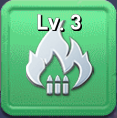 | +ATK | Weapon Buff | **Offense** |
| 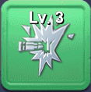 | +CRT | Critical Buff | **Offense** |
| 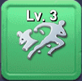 | +DEX | Dextrity | **Defense** |
|  | +ROF | High Rate of Fire | **Offense** |
|  | +DMG | Increase Damage | **Offense** |
| 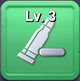 | -DMG | Decrease Damage | **Defense** |
| 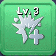 | +CRT | Increase Critical Damage | **Offense** |
| 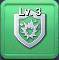 | +INV | Decrease Critical Damage | **Defense** |
|  | +HIT | Increase Hit Rate | **Offense** |

### Battle Buff
1. ④ `Army HP Boost`
2. ④ `Army Attack`
3. ④ `Army DMG Increase - Given`
4. ④ `Army DMG Decrease - Taken`
5. ④ `Suppression` for Air Force

### Class CP » General Talent
General Talents are unit type specific abilities that provide various bonuses to your troops, enhancing their overall performance in battles. These talents can be upgraded to increase their effectiveness.

| **Attack Bonus** | **Attack Description** | **HP Bonus** | **HP Description** |
|---|---|---|---|
| 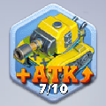 | Army `ATK` » Air DMG Bonus | 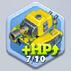 | Army `HP` « Air DEF Bonus |
| 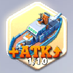 | Navy `ATK` » Army DMG Bonus | 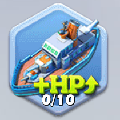 | Navy `HP` « Army DEF Bonus |
| 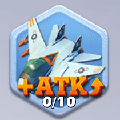 | Air `ATK` » Navy DMG Bonus | 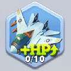 | Air `HP` « Navy DEF Bonus |

### Formation Center
Formations are strategic arrangements of your troops that provide various buffs and advantages in battle. Each formation has its own unique benefits and can be upgraded to enhance its effectiveness.

**Formation Data:**
| Title | Description | Note |
|---|---|---|
| Formation | Shark, Scorpion, Eagle | Upgraded Separately |
| Buffs Slots | `1, 2, 3, 5, 8` | All Formations |
| Shark Level | 41/50 | Max. 50 |
| Shark Tier | 4/10 | Max. 10 |
| Shark Tier 3 | Adds Increase DMG | |
| Shark Tier 5 | Unlocks Swift Strike | |
| Shark Specialization | `5` levels | Upgrade Slots Separately |

**Formation & Buff Slots**
Formations are in a `T` form adding buffs to the units behind them. Each formation, & slot specialization should be upgraded separately. As shown below slot 1 is level 2 & slot 2, 3, 5 all are level 0.

### Gathering » Dimentional Mine
Dimensional Mine is a special type of mine that allows players to gather resources from multiple dimensions.

### Gathering » March
Marching to gather resources is a fundamental aspect of Top War. Efficient gathering strategies can significantly boost your resource income, allowing for faster base development and troop training.

**Ideal Gathering March:**
An ideal gathering march has less than 1 day (24h) gathering speed on RSS6 resources, allowing full gathering of RSS6 resources per day to maximize crafting Arsenal Components.

1. ⭐⭐⭐⭐⭐ 1d or less
2. ⭐⭐⭐⭐ 1d 1h - 6h
3. ⭐⭐⭐ 1d 6h - 12h
4. ⭐⭐ 1d 12h - 18h
5. ⭐ 1d 18h or more

**War Hall » Lineup » Gather Table**
| Performance | Speed | Full Size | March |
|---|---|---|---|
| ⭐⭐⭐⭐ | 1d 6h | 72 | Kate Curry, Black Widow, Ishi Tarou |
| ⭐⭐⭐ | 1d 12h | 72 | Hammer, Rambo, Wade |
| ⭐⭐ | 1d 14h | 63 | Ganso, Alex, O’Neill |
| ⭐ | 2d 2h | 72 | Ricardo, Simon, Tywin |
| ⭐⭐ | 1d 16h | 63 | Dr. Gero, Amalia, Friedman Hetrz |
| ⭐ | 1d 23h | 63 | Stoick, Reichstein, Bob |
| ⭐⭐ | 1d 16h | 72 | Bob, Smion, Belleveu |
| ⭐⭐⭐ | 1d 12h | 72 | Bradley, Rohr, Hatrman |

### Gathering » RSS6
RSS6 refers to level 6 `Farmland`, or `Oil Field` resource tiles, which give special colored stones used to craft components for equipment.

**Colored Stones Rarity:**
1. **Green**: Common rarity.
2. **Blue**: Uncommon rarity.
3. **Purple**: Rare rarity.
4. **Gold (or orange)**: Super Rare rarity.

**How to Use RSS6 Stones:**
1. Gather from RSS6 Tiles to obtain the colored stones.
2. Use the stones to craft components for different equipment types.
3. As you acquire more stones, you can craft higher-rarity equipment.

**Importance of Gathering RSS6 Stones:**
* **`Craft Center` upgrades**: 4 different colored stones craft a Lv. 3 component.
* **A major source of power**: High-level equipment improves your combat power.
* **Alliance benefit**: RSS6 spawns in the Ruins Campaign.

### Gathering » RSS6 & Colored Stones
In gathering marches, sending fewer units to RSS6 does reduce colored stone drops. Unit count affects carrying capacity, and stone yield.

**Key Points:**
* The total amount of colored stones is fixed.
* Gathering speed and capacity are keys for efficiency.
* More units increase your carrying capacity.
* The key to maximizing stones is load capacity.
* Larger the gathering load, the more stones you get.

**RSS6 Gathering Strategy:**
To maximize your stone yield from RSS6, consider the following strategies:
* Send full units to increase carrying capacity.
* Optimize speed using hero gathering speed skills.
* Maximize capacity using hero load capcity skills.
* Utilize heroes with gathering bonuses.

**Rapid Gathering vs. Full Capacity:**
As shown in the top four rapid gathering reports, the colored stone average yield is `2.5` stones, but in the three bottom full capacity gathering reports the colored stone average yield is `5` stones.

### Hero Bond
Hero Bonds are special relationships between certain heroes that provide additional bonuses when those heroes are in your roster, regardless of whether those heroes are used together in a march.

### Hero » List
1. `R`: Rare
2. `SR`: Super Rare
3. `SSR`: Super Super Rare (also called Legendary)

### Hero » March Combat Power
To underestand **Quede Combat Power** notice when you hit **World Boss** 5 times each round, maultiple times in day the damage per hit changes each time randomly even when all other factors are constant. This is due to complex calculation of **Quede Combat Power** which depends on many factors including hero march size, decoration march size, hero bond for march size, unit types of oponnets, buffs and other combat related upgrades.

**Top War** adding insult to injury when player add more buff, more power and after weeeks of grinding and many relvant upgrades when everything seems better, attacking the `WB` not only won‘t improve but the damage per hit decrases! This is due to complex calculation of **Quede Combat Power** which depends on many factors with a twist of so called randomness.

 Some may argue this randomness add more exictment to the game but the question is why is always in the negative direction? some may counter argue that beacuse of randomness you hit harder than you could and becaue of randomness that best attack was a jackpot hit. But in reality is in-game purchace feature of freemium and is more like business intentional reason than what is argued based on complex formula with randomness!

| Item | Description |
|---|---|
| CP | **Combat Power**: Total Combat Power of a Player‘s all units except damaged units<br>- `CP` affect how many units defend or get damged when base hit<br>- `CP` corrolate directly with decoration<br>- `CP` indicate player overal base value but not effective combat power<br>- To avoid confusion consider `CP` only as base value |
| QCP | **Quede Combat Power**: Total Quede Combat Power of a player march<br>- `QCP` affect march `QCP` which depends on:<br>- Hero March Size<br>- Decoration March Size<br>- Hero Bond for March size<br>- Unit types of oponnets, buffs and other combat related upgrades affect `QCP`<br>- Consider `QCP` as mix of many metrics with complex caluation which changes instantly and randomly! |
| TP | **Troop Power** is the total power of all troops in base and march excluding damaged ones<br>- `TP` affected when trooped are in repair or damaged and must be degraded. |
| March Size | **March Size** is the total number of units in a march<br>- `March Size` affect how many units defend or get damged when march hit |
| Hero Slots | **Hero Slots** is the number of heroes in a march<br>- `Hero Slots` affect march `QCP` which depends on:<br>- Hero March Size<br>- Decoration March Size<br>- Hero Bond for March size |

### Hero » March Size
| Player | CP <sup>gg</sup> | March <sup>as of 2025-08-24</sup> |
|---|---|---|
| UncleW | 17,000 | Sara, Binary, Marvingt |
| Tnight | 12,300 | Sara, Binary, Marvingt |
| B | 12,230 | Nelle, Binary, Quily |
| Bulldog | 2,530 | Jill Valentine, Shen Suyu, Jester |
| Catman | 1,150 | Quily, Rohr, Binary |
| TomWiz | 0.704 | Diana, Katyusha |
| LouBelle | 0.686 | Nelle, Quily |

### Hero » Selection
`To Do`: Exchange Reichstein’s Perk with Simon’s Perk - used as Perk Mulle.

**I. Current Heroes**
1. ⭐⭐⭐⭐⭐ `Kate Curry`, Gathering Speed
2. ⭐⭐⭐⭐⭐ `Kuruzo`, Training Speed
3. ⭐⭐⭐⭐ `Amalia`, Gathering Box
4. ⭐⭐⭐⭐ `Marvingt`, 3HM
5. ⭐⭐⭐ `Rohr`, 3HM

**II. Next Hero » 3HM**
1. `Delhuyar`, Gathering Odinium speed
2. **Army**: `Marvingt`, `Binary`, `Sarah`
3. **Army**: `Quily`, `Rohr`, `Nelle`
4. **Air Force**: `Hiccup`, `Jett`, `Vivian` or `Lin`
5. **Navy**: `Stoick`, `Jester`, `Alvida`

**III. 3 Heros March**
`Binary` is the replacement of `Nelle`.
1. `Rohr`, `Binary/Nelle`, `Quily/Sarah`

**IV. Hero Perks**
1. Max Hero to 5 stars
2. Max Hero to level +100 to unlock all skills
3. Use Hero Mulle to add perks (min 100 shards)
4. Use Hero Exclusive Skill Shards to level 5
5. Use Perk Book to Swap perks:
    1. All Unit HP Boost
    2. All Unit Attack
    3. Special Type (Army, Navy, Air) Unit HP Boost
    4. Special Type (Army, Navy, Air) Unit Attack
6. DMG Increse

### Hero » Selection » Combo
**Hero Offensive Combo**
Hero **Offensive Combo** focuses on maximizing the attack capabilities of your heroes. This combo is ideal for players who want to enhance their offensive strategies and deal significant damage to opponents.

**Hero Defensive Combo**
Hero **Defensive Combo** is designed to bolster the defensive capabilities of your heroes. This combo is perfect for players who prioritize survivability and want to protect their heroes from enemy attacks.

### Hero » Set
Marvingt `80%`, Binary `60%`, Quily `50%`, Sara `40%`

* Army: Marvingt, Binary, Sara or Quily
* Navy: Stoick, Jester, Alvida
* Air Force: Hiccup, Jett, Vivian or Lin

### Hero » Skills
Hero Skill Sets are divided into two pages from the different skills of `1:Primary` and `2:Supportive` skills. A hero can have skills from both branches active simultaneously, but only one set of skills is used at a time. Consider Hero current equipped skills too when calculating.

### Power Progress
| Date | Power | TomWiz | Bulgar |
|---|---|---|---|
| 08-01 | Combat Power | 21.7M | 20.3M |
| 08-10 | Troops Power | 0.187 | 0.558 |
| 08-20 | Troops Power | 1,180 | 1,230 |
| 08-30 | Troops Power | 6,840 | 3,990 |
| 09-10 | Troops Power | 1,010,000 | 115,000 |
| 09-20 | Troops Power | 2,000,000 | 615,000 |

### Profile
UID: `9002223931352`. Sanpshot as of 2025-08-18.

### Titan Gears
Titan Gears are special equipment that can be equipped to your troops to enhance their combat abilities.

**Titan Gears Types:**
1. Assault Pistol
2. Tactical Back Armor
3. Optical Add-On
4. Rayheon Headset
5. Portable GPS
6. Power Boots

### Units » Capacity
| Name | Description |
|---|---|
| Cap. | Available Capacity |
| All | Total Capacity |
| In | Units in Garage, Hangar, or Dock |
| Str. | Garage, Hangar, or Dock capacity |
| Out | Capacity out of storage space |

---

## 2. Advanced Strategy

### HT » Core Chips
Heavy Trooper Core Chips are essential components used to upgrade and enhance the capabilities of Heavy Troopers in Top War.

### HT » Pre-Set
In Legendary Squad Battles, having the right equipment pre-set for your Heavy Troopers can make a significant difference.

### Ultra Valhalla » Army
| Feature | E-0 Aegis Anti-Tank Gun | T1- Thunder Tank |
|---|---|---|
| Primary Role | Aggressive **Offense** | Powerful **Defense** |
| Base Stat Focus | Stronger attack power | Higher HP and durability |
| Special Skill | Initial high burst DMG | Random DMG decrease |
| Best Use | PvP attacks on enemy bases | Base defense for PvP & PvE |

**Ultra Valhalla Swap:**
You can swap between E-0 and T-1 once every `24` hours if you have researched both branches to the same level.

### Ultra Valhalla » Navy
| Feature | T3 Trident Destroyer | So-3 Sounion GEV |
|---|---|---|
| Primary Role | High **Damage Output** | Superior **Survivability** |
| Base Stat Focus | Enhanced attack and critical rate | Boosted HP and defense |
| Special Skill | Burst DMG at start of battle | Chance to reduce incoming DMG |
| Best Use | PvP Naval assaults & Boss fights | Defensive setups, holding key positions |

### Ultra Valhalla » Air Force
| Feature | G-10 Golden Bow Bomber | S-12 Aethon Fighter |
|---|---|---|
| Primary Role | High **Damage Output** | Superior **Survivability** |
| Base Stat Focus | Enhanced attack and critical rate | Boosted HP and defense |
| Special Skill | Burst DMG at start of battle | Chance to reduce incoming DMG |
| Best Use | PvP Air assaults & Boss fights | Defensive setups, holding key positions |

---

## 3. Combat Strategy

### Battle Report » Droid
**Unit Specific Stats**
| Value | Army | Navy | Air Force |
|---|---|---|---|
| HP Boost | 1095.6% | 593.7% | 557.5% |
| Attack | 1099.3% | 735.4% | 752.6% |
| DMG Increase | 91.6% | 47.1% | 43.2% |
| DMG Decrease | 110.2% | 55.7% | 61.1% |
| ATK Speed Bonus | 300.0% | 200.0% | 200.0% |

**General Stats**
| Value | Description |
|---|---|
| 40 | March size |
| 15 | Total battle round |
| 18.0% | Army Starting Shield |

---

## 4. Chat
### Chat Shortcuts
```text
Heya 🫡 ... Good Morning, Good Afternoon, Good Evening & Good Night Commanders!
```

```text
Cya 😵‍💫 ... Good Morning, Good Afternoon, Good Evening & Good Night Commanders!
```

```text
IMAO 🤔 Pls DO NOT take me Seriously! Seriously!  🤯 🤪
```

```text
DNAnM 🤔 Defenitly NOT A Naughty Mom! Sexriously!  🤯 🤪
```

```text
Look me up in 2001:4860:4860::8888 and 2001:4860:4860::8888 🔊
```

```text
New scientific research shows Gorillas facing new evidence change their mind! How about you?
```

```text
IMAO: Never underestimate people‘s stupidity, including your own. Arguing with fools is foolish—if you disagree, that‘s foolish too. Non-negotiable!
```

---
**Version:** 1.0
**Status:** Draft
**Last Updated:** 2026-01-29
