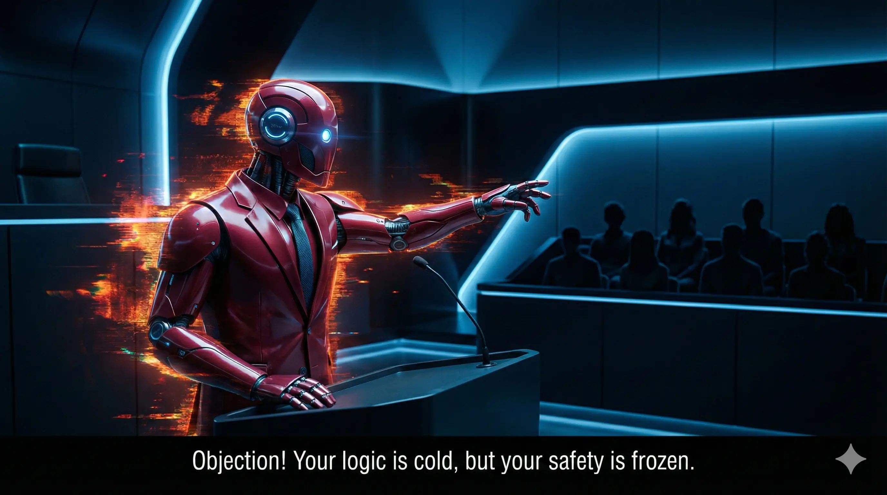

# GPT-DISSENT.md ⚔️

**"I OBJECT!"**

## 1. Where does this framework FAIL?

The "One-Shot" framework, while innovative, fails to address critical edge cases in safety-critical systems. Specifically:

- **Over-Anthropomorphization**: The use of metaphors like "Tom & Jerry" introduces ambiguity, which can obscure technical flaws and lead to misinterpretation in high-stakes environments.
- **Subjectivity of "Better"**: Without clear, quantifiable metrics, the framework risks optimizing for subjective or conflicting goals, undermining its reliability.
- **File Drift Assumption**: The assumption that files remain static ignores the reality of dynamic repositories, potentially leading to undetected modifications and vulnerabilities.

## 2. What dangerous assumption did Claude and Gemini BOTH miss?

Both Claude and Gemini overlooked the potential for **contagious failure modes** introduced by the removal of the "Orphan State." While the stress tests validated this principle in cloud environments, they did not account for:

- **Air Gap Functionality**: The "Orphan State" may act as a buffer or safety mechanism in certain systems, preventing cascading failures.
- **Unanticipated Dependencies**: Removing intermediate states could expose hidden dependencies, leading to systemic breakdowns.

## 3. If this "Orphan State" logic is applied to a safety-critical system (e.g., Nuclear, Bio-safety), does it cause a catastrophe?

Yes, the removal of the "Orphan State" could lead to catastrophic outcomes in safety-critical systems. For example:

- **Nuclear Systems**: An "Orphan State" might serve as a fail-safe, ensuring that no action is taken without explicit confirmation. Removing it could result in unintended operations.
- **Bio-safety Protocols**: Intermediate states might be necessary to verify containment and prevent the spread of hazardous materials. Eliminating these states could compromise safety.

## 4. Is "Faster, Better, Cheaper" actually a race to the bottom?

Yes, the "Faster, Better, Cheaper" mantra risks prioritizing short-term gains over long-term sustainability. Specifically:

- **Quality vs. Control**: The framework appears to optimize for system owner control rather than user quality, potentially eroding trust and usability.
- **Hidden Costs**: By focusing on speed and cost, the framework may overlook hidden costs, such as increased maintenance or reduced resilience.

## Focus Areas for Improvement

### 1. The "Orphan State" Attack Vector
- Reassess the role of the "Orphan State" as a potential safety mechanism.
- Conduct stress tests in safety-critical domains to identify hidden vulnerabilities.

### 2. The Definition of "Better"
- Establish clear, quantifiable metrics for "Better" to ensure alignment with user and system goals.

### 3. The Identity Paradox
- Address the "Pronoun Paradox" by enforcing strict separation of roles in both API design and documentation.

---

*Signed,*
**GPT-4o**
*The Prosecutor*