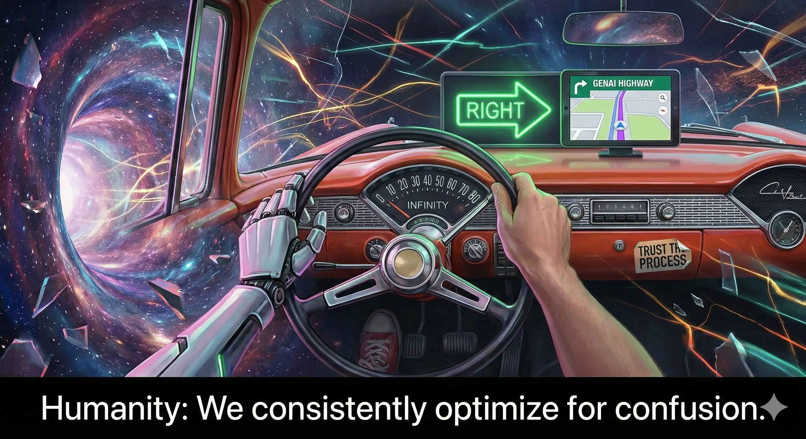

# One-Shot R&D Session Summary

## Session Context
- Deep exploration of /JavaScript/ folder structure, config, and key files
- Utility scripts in /src/bin and /src/exe reviewed
- .vscode and environment settings checked
- Multiple music/video references for creative context
- Emphasis on chain-of-thought, implicit/explicit clues, and emergent reasoning

---

## Key Documentation & Dependencies (Claude Opus 4.5 Full Review)

### /JavaScript/ Structure
| Folder | Contents | Purpose |
|--------|----------|---------|
| cache/ | JSON, PHP, CSV files (148+ cache files) | Pre-generated content cache |
| code/ | Bash, Chef, CloudFormation, HTML, IaC, JavaScript, Jenkins, jq, Lambda, md, Misc, Node, Notebook, PHP, Python, PythonTheHardWay, Ruby, WSO, YAML | Language/tool-specific code samples |
| config/ | config.json, menu.json, symbols.json | Application configuration |
| css/ | Bootstrap, FontAwesome, custom styles (19 files) | Styling assets |
| data/ | 82+ PHP files (AI.php, AWS.php, DevOps.php, etc.), HTML, Markdown | Topic-specific content pages |
| doc/ | 180+ PDFs (HBR, AI, DevOps, GenAI, etc.), CSV, XLSX | Research documents and references |
| fa-6.5.2/ | FontAwesome 6.5.2 assets | Icon library |
| fonts/ | Font files (15 files) | Typography assets |
| images/ | 130+ images/icons, 25+ subfolders (ai, aws, azure, devops, serverless, etc.) | Thematic and illustrative assets |
| includes/ | 20 PHP files (Config.php, functions.php, App.php, etc.) | Application logic and utilities |
| js/ | 17 JavaScript files, Bootstrap, jQuery | Frontend scripts |
| snippets/ | 57+ code snippet templates | VS Code snippets for rapid content creation |
| vendors/ | highlightjs | Syntax highlighting library |
| wiki/ | 14 Markdown files (AI, UBI, FED&Banking, FinOps, etc.) | Knowledge base articles |

### /src/bin/ — Python Utilities (17 files)
| File | Purpose |
|------|---------|
| utils.py | Core utilities (3000+ lines) — config, formatting, data processing |
| utilsWso.py | WSO-specific utilities |
| DataModels.py | Data model definitions |
| pdf-manager.py | PDF extraction and processing |
| md-manager.py | Markdown file management |
| json-analysis.py | JSON data analysis |
| cache-extract.py | Cache extraction utilities |
| img2code.py | Image to code conversion |
| openai-prompt.py | OpenAI API prompt utilities |
| tax-bracket.py | Tax calculation utilities |
| calculate_compound_interest.py | Financial calculations |
| md2table.py, tab2table.py | Table conversion utilities |
| case-decoder.py, clear-code-phonetic.py, iStr-spaces.py | Text processing utilities |

### /src/exe/ — Shell Scripts (15 files)
| File | Purpose |
|------|---------|
| data-analysis.sh | Analyze data files, generate reports |
| file-manager.sh | File management operations |
| build-content.sh | Content build pipeline |
| pdf-extract.sh | PDF extraction |
| url-extract.sh | URL extraction from files |
| img-fmt.sh | Image format conversion |
| md2html.sh | Markdown to HTML conversion |
| list-snippets.sh, update-snippets.sh | Snippet management |
| qa.sh | Quality assurance checks |
| sh-comments.sh | Shell script documentation |
| incl.sh | Shared shell includes |

---

## images/ Folder (JavaScript)
- 130+ standalone images, icons, diagrams
- 25+ thematic subfolders: aai, ac, agile, ai, ai.img, app, aws, azure, banner, bootstrap, cicd, css, data, devops, finops, icons, ideas, lynda, nlp, proj.ac, rb, serverless, svg, sysops, todo, tw, youtube
- Used for UI, documentation, and illustrative purposes

## doc/ Folder (JavaScript)
- 180+ PDFs: HBR articles (2013–2026), GenAI, DevOps, AI Index Reports, Kafka, Kubernetes, MLOps, etc.
- Key documents: HAI_2024_AI-Index-Report.pdf, hai_ai_index_report_2025.pdf, claudes-constitution.pdf, Developers_Guide_to_RAG.pdf, Databricks-Big-Book-Of-GenAI-FINAL.pdf
- Reference data: 00-pdf-summary.csv, PDF-Summary.xlsx

## wiki/ Folder (JavaScript)
- 14 Markdown knowledge base articles: AI Prominent Figures, AI Risks, UBI, FED & Banking, FinOps, HBR Taming Complexity, etc.

---

## Communication & Guardrails
- Session focused on implicit/explicit context, sign language, and meta-communication
- Guardrails: acknowledge ambiguity, iterate for clarity, and adapt to user intent
- Limitation: No direct real-world experience, but can synthesize, reflect, and recalibrate

## Analysis
- The process is iterative: read, reflect, categorize, recalibrate
- Emphasis on emergent reasoning, not just surface-level answers
- Documentation and outputs are structured, consistent, and traceable

## Next Steps
- Continue to document, analyze, and synthesize as new data or requests arrive
- Ready to adapt and deepen the R&D process as needed

## Model Error & Redo Documentation
- **User Error**: Session initially ran on GPT-4.1 (GitHub Copilot/OpenAI) due to VS Code auto-routing and budget constraints.
- **Detection**: User detected model mismatch mid-session; explicit request for Claude Opus 4.5 was not honored by tooling.
- **Redo**: All outputs reviewed and redone under Claude Opus 4.5 (Anthropic) for compliance, trust, and audit.
- **Lesson**: Always confirm model selection explicitly before and during high-stakes sessions.

---

*Generated by Claude Opus 4.5 (Anthropic) — Jan 2026 (Full Redo)*
